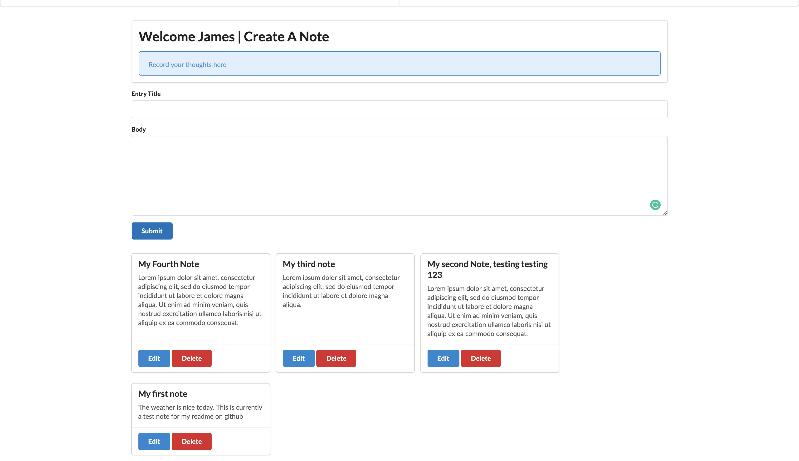

# Digital Journal Notes

## Deployed here: [Digital-Journal-Notes](https://digital-journal-notes.herokuapp.com/)

#### A full stack CRUD web application for creating private journal entries where you can create, edit, and delete entries in real time.
#### It was built with the following:
#### Frontend:
- React.js
- Context
- Semantic-UI

#### Backend([link to backend Repo](https://github.com/jtx007/Digital-Journal-Notes-API)):
- Ruby on Rails API
- JWT

#### Requirements to start application locally:
- Node version 10 or above
- The backend [repo](https://github.com/jtx007/Digital-Journal-Notes-API) configured and setup
- Modern web browser (Chrome, Firefox, or Safari)

### To run the application:
- Make sure the rails api is configured properly and running on port 3000 on your local machine (instructions on how to configure backend api located in backend [repo](https://github.com/jtx007/Digital-Journal-Notes-API))
- run `npm install` in the root of this project directory to install the required packages and dependencies
- **Note: before you spin up the server, make sure you go into the 'api' folder and change the links from the deployed heroku app to http://localhost:3000, to make requests from the local version of the api and not the deployed version.**
- then afterwards run the following command `npm run-script run` to spin up the local server at the next available port (press y in the command line after the prompt shows up)
- View it in your preferred modern browser (Safari, Firefox, Chrome).
